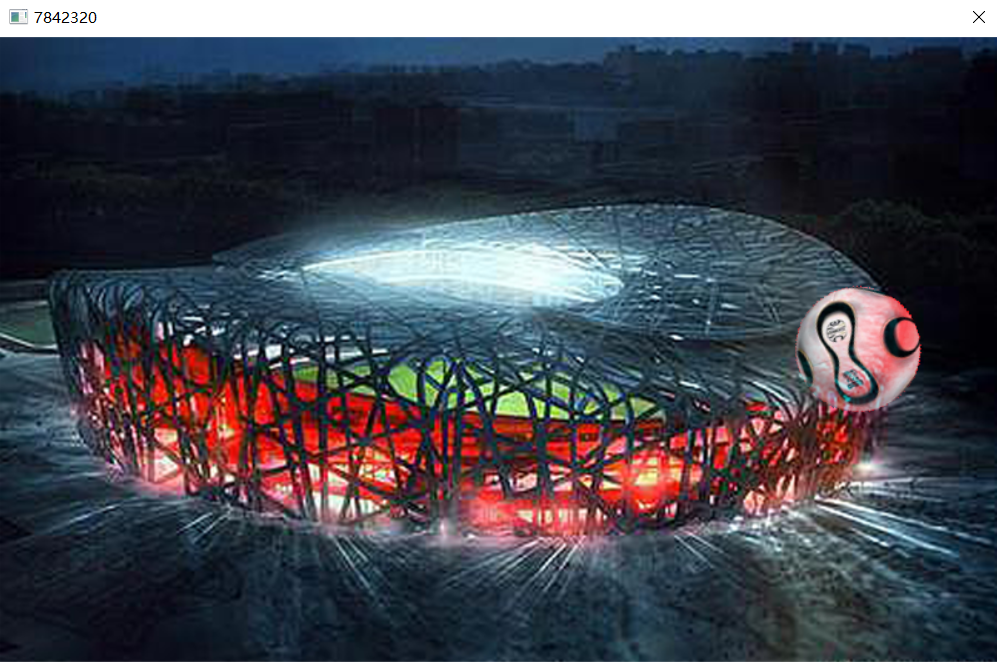
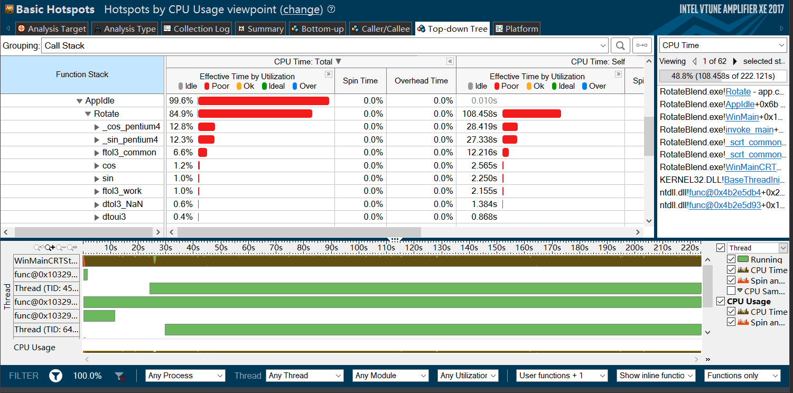
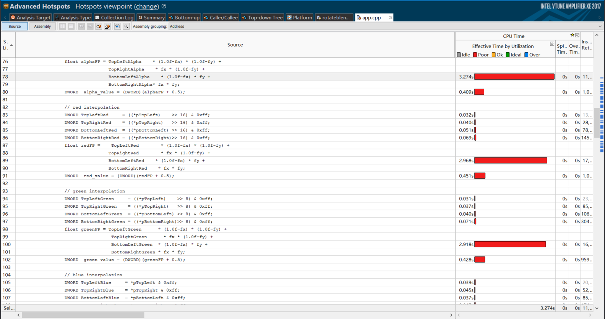
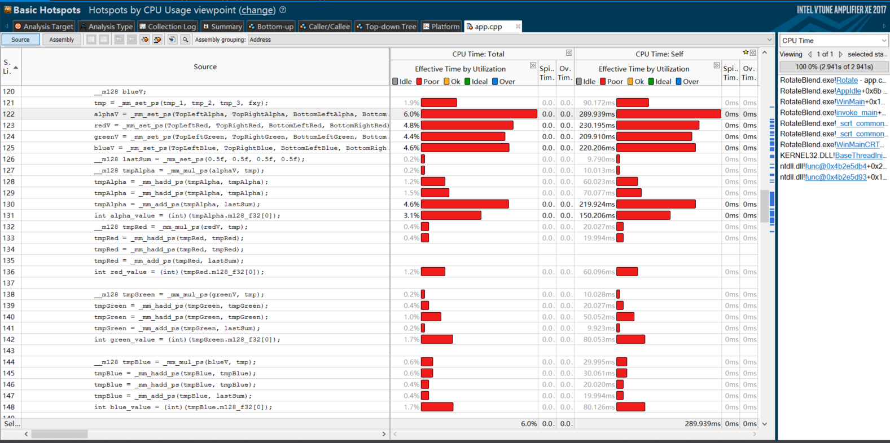
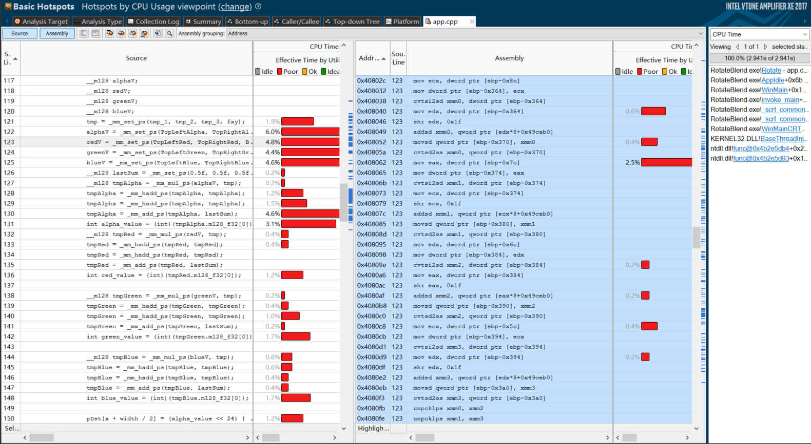
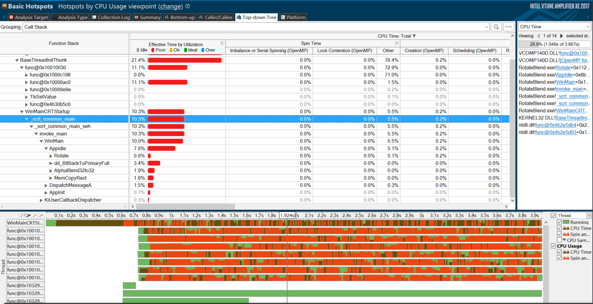

# Lab1: Optimize the Image Rotating Program

The purpose of this repo is to optimize the image rotating program in Visual C++.

## Table of Contents
- [Requirements](#requirements)
- [Optimization methods](#opt-methods)
- [Contributing](#contri)
- [Contact](#contact)

## <a name="requirements"></a>Requirements

Lab1 requires the following to run:
- Visual Studio (2012 and 2015 are ok)
- Vtune [optional]

## <a name="opt-methods"></a>Optimization methods

> Because of lazy, I will use Chinese to describe this part as my lab report. English will be online soon.

本节主要分四部分说明：
- [实验环境](#envi)
- [重复计算提出循环](#repeat_c)
- [使用 sse2 向量化指令](#sse2)
- [使用 openMP 对 for 循环进行并行计算](#openMP)
- [总结](#sum)

### <a name="envi"></a>实验环境

- Operating System： Microsoft Windows 10
- IDE：Visual Studio 2015
- CPU: Intel(R) Core(TM) Processor code named Haswell
	- Frequency: 2.6 GHz
	- Logical CPU Count: 8


### <a name="repeat_c"></a> 重复计算提出循环
首先使用 Vtune 工具可以看到程序运行的时间主要消耗在

``` cpp
void Rotate(DWORD *pDst, long DPitch, DWORD *pSrc, long SPitch, long width, long  height, float angle);
```

`Rotate` 函数的作用就是旋转图片，旋转的方法是遍历图片的每一个像素点，通过计算得到该点旋转之前的位置，将附近的四个像素点进行插值得到新的像素点。

运行程序之后，界面如下图所示：


在程序的左上角有一个衡量程序运行速度的指标，越小表示越快，没有经过任何优化的程序运行时数值为 `7842320`

使用 `Vtune` 工具分析程序可以看到：



`Rotate` 占了总运行时间的 84.9%, 同时可以注意到 `sin` 和 `cos` 两个函数的计算也占用了比较多的时间，进入到代码中可以发现:

``` cpp
...
for (int y=-height/2; y<height/2; y++)
{
	for (int x=-width/2; x<width/2; x++)
    {
    	float fSrcX = (float)(width /2.0 + x*cos(angle) - y*sin(angle));
		float fSrcY = (float)(height/2.0 + x*sin(angle) + y*cos(angle));
        ...
    }
    ...
}
...
```
`angle` 作为函数传入的参数一直没有变化，在循环的时候 `sin` 和 `cos` 的值被重复计算了很多次，因此首先想到的就是将 `sin` 和 `cos` 的计算提出循环，修改代码如下

``` cpp
...
float sin_angle = sin(angle);
float cos_angle = cos(angle);
for (int y=-height/2; y<height/2; y++)
{
	...
	float tmp_y_sin = width / 2.0 - y * sin_angle;
	float tmp_y_cos = height / 2.0 + y * cos_angle;
	for (int x=-width/2; x<width/2; x++)
    {
    	float fSrcX = (float)(x*cos_angle + tmp_y_sin);
		float fSrcY = (float)(x*sin_angle + tmp_y_cos);
        ...
    }
    ...
}
...
```

运行之后，可以看到程序运行时的数值为 `4666625`，程序性能有所提升，使用 `Vtune` 测试性能如下



### <a name="sse2"></a> 使用 sse2 向量化指令
这个时候主要的时间消耗在了图像四个通道的插值计算上，观察可以发现一个是有重复计算，一个是这个四个计算毫不相关，因此可以使用向量化指令将其向量化，这里使用 `sse2` 的向量化指令，修改之后的代码如下

``` cpp
...
for (int y=-height/2; y<height/2; y++)
{
	...
	for (int x=-width/2; x<width/2; x++)
    {
        ...
        float tmp_1 = 1.0f - fx - fy + fxy;
		float tmp_2 = fx - fxy;
		float tmp_3 = fy - fxy;

		// 使用向量化

		__m128 tmp;
		__m128 alphaV;
		__m128 redV;
		__m128 greenV;
		__m128 blueV;
		tmp = _mm_set_ps(tmp_1, tmp_2, tmp_3, fxy);
		alphaV = _mm_set_ps(TopLeftAlpha, TopRightAlpha, BottomLeftAlpha, BottomRightAlpha);
		redV = _mm_set_ps(TopLeftRed, TopRightRed, BottomLeftRed, BottomRightRed);
		greenV = _mm_set_ps(TopLeftGreen, TopRightGreen, BottomLeftGreen, BottomRightGreen);
		blueV = _mm_set_ps(TopLeftBlue, TopRightBlue, BottomLeftBlue, BottomRightBlue);
		__m128 bias = _mm_set_ps(0.5f, 0.5f, 0.5f, 0.5f);
		__m128 tmpAlpha = _mm_mul_ps(alphaV, tmp);
		tmpAlpha = _mm_hadd_ps(tmpAlpha, tmpAlpha);
		tmpAlpha = _mm_hadd_ps(tmpAlpha, tmpAlpha);
		tmpAlpha = _mm_add_ps(tmpAlpha, bias);
		int alpha_value = (int)(tmpAlpha.m128_f32[0]);
		__m128 tmpRed = _mm_mul_ps(redV, tmp);
		tmpRed = _mm_hadd_ps(tmpRed, tmpRed);
		tmpRed = _mm_hadd_ps(tmpRed, tmpRed);
		tmpRed = _mm_add_ps(tmpRed, bias);
		int red_value = (int)(tmpRed.m128_f32[0]);

		__m128 tmpGreen = _mm_mul_ps(greenV, tmp);
		tmpGreen = _mm_hadd_ps(tmpGreen, tmpGreen);
		tmpGreen = _mm_hadd_ps(tmpGreen, tmpGreen);
		tmpGreen = _mm_add_ps(tmpGreen, bias);
		int green_value = (int)(tmpGreen.m128_f32[0]);

		__m128 tmpBlue = _mm_mul_ps(blueV, tmp);
		tmpBlue = _mm_hadd_ps(tmpBlue, tmpBlue);
		tmpBlue = _mm_hadd_ps(tmpBlue, tmpBlue);
		tmpBlue = _mm_add_ps(tmpBlue, bias);
		int blue_value = (int)(tmpBlue.m128_f32[0]);

		pDst[x + width / 2] = (alpha_value << 24) | (red_value << 16) | (green_value << 8) | (blue_value);
    }
    ...
}
...
```

使用向量化后得到的数值为 `2908021`, 性能分析如下



可以看到主要的时间消耗不再是浮点数的计算，而是在初始化数据以及转换数据的过程，也就是 `load` 和 `store` 的过程，查看汇编代码



可以看到，造成这种问题的主要原因出现在访存上，第一次 `load` 数据时，并没有很耗时，因此使用的是向量化寄存器，可以猜测可能是向量化寄存器不够用了。向量化对于一次加载数据，多次计算的这种情况非常管用，因此计算占用的时间非常少。

### <a name="openMP"></a>使用 openMP 对 for 循环进行并行计算

在 `Rotate` 函数中设计两个循环，使用 `openMP` 对内循环进行并行计算，添加代码如下

``` cpp
...
for (int y=-height/2; y<height/2; y++)
{
	...
	#pragma omp parallel for
	for (int x=-width/2; x<width/2; x++)
    {
        ...
    }
    ...
}
...
```

运行程序得到的数值为 `1803764`, 使用 `Vtune` 工具分析



可以看到计算的部分已基本不占什么时间，但是并行带来的问题也比较明显，`Spin time` 的时间非常高。

### <a name="sum"></a>总结

| 优化的方法	    | 性能指标(累积)   |
| :-------:    | :------------: |
| 原始|7842320|
|重复计算提出循环|4666625|
|sse2|2908021|
|openMP|1703764|

## <a name="contri"></a> Contributing

I'm a newer master student. Any advice and suggestion are welcome!

## <a name="contact"></a> Contact

You can contact me using following methods:
- Email: xiaxin0202@foxmail.com
- WechatID: xiaxin0202
