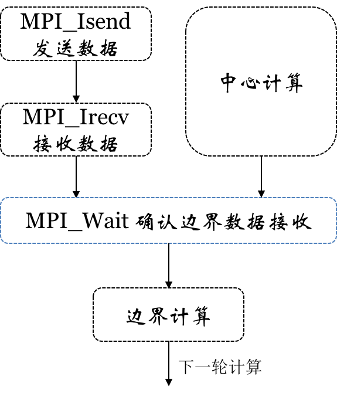

# <center> 高性能计算实验一报告

<center>夏鑫 2016210981 计研162</center>


### 内容列表
- [程序题意分析](#problem)  
- [单机程序多线程优化](#single)  
- [分布式优化](#multi)
- [性能测试](#experiment)

### <a name="problem"></a> 程序题意分析 / Problem Description

> <strong>Brief in English </strong>   
> The problem is to update every node in a cube using the surrounding six nodes in a distributed environment. The Main challenges can be considered as two:  
> 1. The bounder nodes have to ***pull*** data from other machines.  
> 2. Local computation suffers cache miss problem.

本题是对立方体的更新，对当前节点的更新需要上下左右前后六个点的值。这一题主要的挑战为：

- 边界节点值得更新处理情况不同，分布式涉及边界的通信。  
- 单个节点需要的值存储位置不连续，cache miss较高

本次实验内容主要包括为：

- 使用 `openmp` 对程序进行单机的多线程的优化
- 使用 `mpi` 对程序进行分布式的优化
- 尝试使用 `cache blocking` 以及 `avx` 向量化的方法进行优化，效果不好
- 性能测试

### <a name="single"></a> 单机程序多线程优化 / Local Computation Optimization

> <strong>Brief in English </strong>   
> I have tried `2.5D cache blocking` technology. But speedup is limited. So for local optimization, I only use openMP to speed up.

对于单机多线程的优化，尝试过使用 `2.5D cache blocking` 或者向量化，但是实现的效果并没有单纯的 `openmp` 的效果好，因此单机多线程的优化仅限于使用 `openmp` 对 `for` 循环做优化。具体代码如下

```c
	#pragma omp parallel for private(j..) schedule (dynamic)
    for (j = 0; j < ny; j++){
        ...
    }
```

### <a name="multi"></a> 分布式优化 / Dstributed Optimization

> <strong>Brief in English </strong>  
> I use two main opetimization techs here:  
> 1. To adapt different kindo of cude, I use the measured bandwidth to determine cube partition.  
> 2. Seperate the bounder computing from the inter nodes computing. In this way, communication and inter nodes computation can be in parallel. The speedup is great.

分布式优化主要包含以下三点:

- [数据划分](#multi_par)
- [通信过程](#multi_com)
- [通信与计算重叠](#multi_overlap)

#### <a name="multi_par"></a>数据划分 / Cube Partition

由于最后程序的性能会卡在通信或者访存的上，不能划分太多使通信太大，也不能划分太少，卡在访存上，因此需要对内存和网络的带宽测试之后决定划分，使用简单的程序得到测试数据如下


######内存 memory bandwidth
| data size | read | write |
| --------- | ---- | ----- |
| 1G        | 28522.069383 MB/s | 21311.166720 MB/s |

######网络 network bandwidth

800 MB/s ~ 820 MB/s

因为每一次写内存最多需要进行 7 次内存的读，因此可以大概估算出来网络和内存的比率，使用一个函数使得访存和网络的相差最小，前提是尽可能用更多的节点，同样的划分个数，保证通信总量最小。  
以8个节点为例

######划分 partition example
| 数据规模(x * y * z) | 划分方案(x,y,z) |
| ------- | ------------- |
|1200 * 60 * 60 | 8, 1, 1|
|1200 * 1200 * 1200 | 2, 2, 2|
|1200 * 1200 * 100 | 2, 4, 1|

#### <a name="multi_com"></a>通信过程 / Communication Model

对于每一个机器上的立方体来说，最多需要更新的面有 6 个。本实验使用了 `receive_buffer` 和 `send_buffer` 来存储需要 6 个接受和发送的数据。  
在每一轮计算的开始将需要发送的数据按照 `x y z` 的顺序写入到 `send_buffer`，然后使用 `MPI_Isend` 发送出去。  
在每一次中心计算的开始使用 `MPI_Irecv` 接受需要的数据

#### <a name="multi_overlap"></a>通信与计算重叠/ Overlab Computation and Communication

分布式的一个重要优化是让中心的计算以及边界数据的通讯重叠起来。具体步骤如下  



### <a name="experiment"></a>性能测试 / Experiments

对于比较小的测例，使用的数量为 2 和 4，大数据集使用 8 节点

| 编号 | 1 | 2 | 3 | 4 | 5 |
| :-----: | :----: | :----: | :----: | :----: | :----: |
| NX | 80 | 150 | 500 | 266 | 100 |
| NY | 80 | 150 | 500 | 798 | 20000 |
| NZ | 80 | 150 | 500 | 2394 | 256 |
| STEPS | 1000 | 500 | 200 | 200 | 200 |
| 参考时间 Time (s) | 0.180085 | 0.212763 | 2.581014 | 10.594452 | 9.391520 |
| 编号 | 1 | 2 | 3 | 4 | 5 |
| NX | 20000 | 2372 | 81 | 800 | 1200 |
| NY | 100 | 2372 | 81 | 800 | 1200 |
| NZ | 256 | 91 | 78000 | 800 | 1200 |
| STEPS | 200 | 200 | 200 | 200 | 100 |
| 参考时间 Time (s) | 6.282537 | 8.714769 | 9.460216 | 11.059239 | 17.797982 |