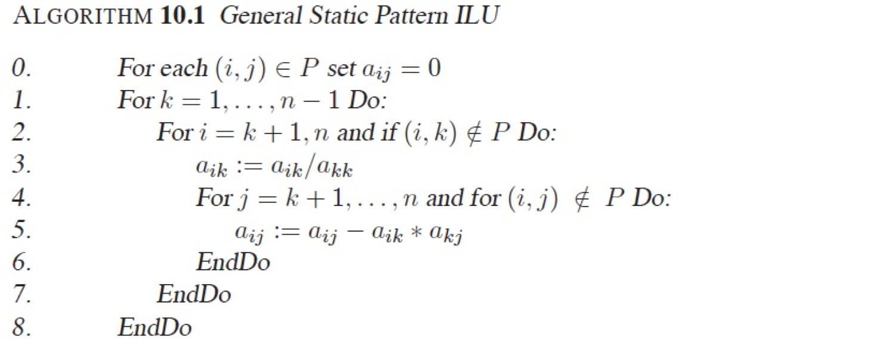
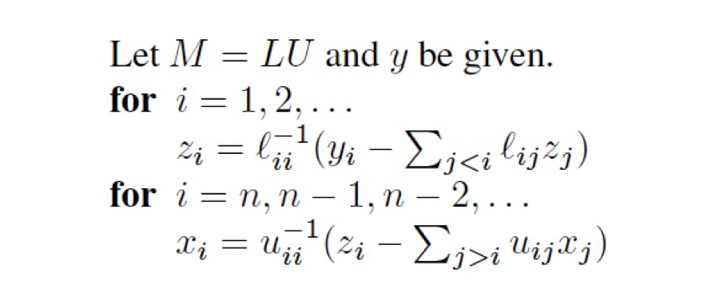
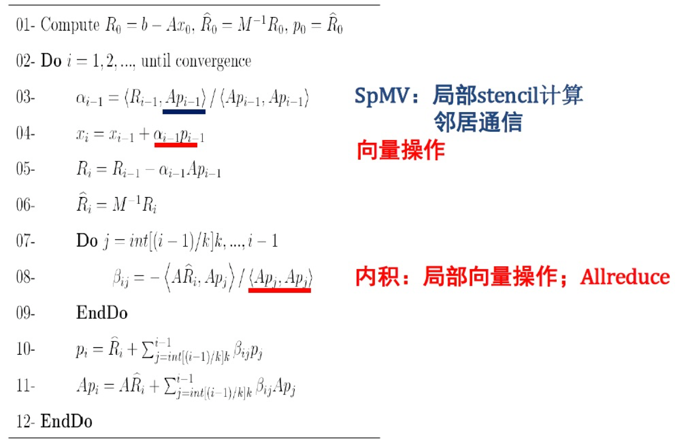

# <center> 高性能计算实验二报告

<center>夏鑫 2016210981 计研162</center>


### 内容列表
- [采用算法描述](#al)  
- [实现细节及优化措施](#detail)  
- [性能测试](#experiment)
- [分析与讨论](#descu)
- [说明](#other)

### <a name="al"></a> 采用算法描述

本节将从以下几个方面说明：

- 预处理的算法
- 求解 $\hat{R}$ 的算法
- 求解方程的算法

#### 预处理的算法

对于预处理，使用的是不完全 `LU` 分解，`ILU(0)`。具体算法如下:



#### 求解 $\hat{R}$ 的算法

需要计算的 $\hat{R} = M^{-1} R$，但是经过预处理得到的只是 $M$。由于 $M = LU$, 其中 $L$ 为单位下三角矩阵，$U$ 为上三角矩阵。因此可以通过求解两个方程来求解方程 $M \hat{R} = R$, 即:
$$
LZ = R \\ U\hat{R} = Z
$$ 

借助上三角以及下三角矩阵的良好性质，可以很方便的求解，具体算法如下：



#### 求解方程的算法

求解方程使用的广义于差法，具体算法如下：




### <a name="detail"></a> 实现细节

本节将从三个方面说明：

- $Ap_{i - 1}$ 相乘的局部通信
- 向量操作
- 矩阵内积
- `IO` 文件读取

#### $Ap_{i - 1}$ 相乘的局部通信

此时由于被划分到不同的机器上，对于矩阵 $A$ 来说，它对于的向量的数值同时有来自其他机器上的值。也就是说 $A$ 并不是一个方阵，是一个 $n * m, m > n$ 的矩阵。因此不管 $A$ 和什么向量相乘，所乘的向量都需要进行局部通信来获取不再该节点上的值。  
对于这一类向量，假设这个节点上的数据大小为 $n$, 需要通信的大小为 $buffer\_ size$ , 使用长度为 $n + buffer\_ size$ 的数组来保存数据。在读入文件时，做了处理使得前 $n$ 个元素表示在本节点上的值，后 $buffer\_ size$ 个元素表示其他节点上的值，矩阵 $A$   使用的是 $CRS$ 来存储数据，列的序号与之对应。这样一来通信完成之后，矩阵乘向量就变得简单了。  
对于这一类通信主要分为两步：

- 发送数据：因为需要数据在对应向量不是连续的，因此在每次发送之前都需要写入到 `send_buffer` 中，然后发送到对应的节点
- 接受数据：接受数据比较直接，因为发送过来的数据和向量后 $buffer\_ size$ 个元素意义对应，可以直接 `memcopy` 完成接受

#### 向量操作

这一类操作是对向量的更新，例如  

$$
\vec{x_i} = \vec{x_i} + \alpha_{i - 1}p_{i - 1}
$$

对于这一类操作，目前代码里面使用的是比较朴实的遍历，如下：

```c
void update_x(double *p_i, double alpha, int len){
    int i;
    #pragma omp parallel private(i)
    {
        #pragma omp for schedule(static)
        for (i = 0; i < len; i++){
            x[i] = x[i] + alpha * p_i[i];
        }
    }

}
```

感觉这里即使使用 `openmp` 加速也不是很多，因为这一部分在整个过程中占的时间也不是很多。

#### 矩阵内积

矩阵内积使用了 `avx` 向量化进行优化，有一定加速，但是由于本身占用时间不多，因此提高不大，具体代码如下：

```c
double avx_dot(double *A, double *B, int N) {
    vec temp = {0};
    N >>=2;
    vec *Av = (vec *)A;
    vec *Bv = (vec *)B;
    int i;
    for(i = 0; i < N; ++i) {
        temp += *Av * *Bv;
        Av++;
        Bv++;
    }
    union {
      vec tempv;
      double tempf[4];
    } u;

    u.tempv = temp;

    double dot = 0;
    for(i = 0; i < VECTOR_SIZE; ++i) {
        dot += u.tempf[i];
    }
    return dot;
}
```

具体思路就是使用 `avx` 向量指令，每 4 个 `double` 类型的数据一起做计算。

#### `IO` 文件读取

首选将文件写入成二进制文件，然后使用文件指针，可以很方面的去处需要的那一块数据，具体代码如下：

```c
	int input_fd = open(filename_A, O_RDONLY);
   	ll size = info.nx * info.ny * info.nz;
    double *data = (double *)malloc(size * 19 * sizeof(double));
    ll file_offset = info.x_start * info.tY * info.nz + info.y_start * info.nz + info.z_start;
    ll result = lseek(input_fd, file_offset * 19 * sizeof(double), SEEK_SET);
    printf("file offset : %d\n", result);
    if ((read(input_fd, data, sizeof(double) * size * 19)) > 0){
    ...
    } else {
    ...
    }
```

### <a name="experiment"></a> 性能测试

`GCR` 计算的时间，包括预处理，内存申请，内存释放。使用 8 节点，`cn02,cn03,cn07,cn08,cn09,cn10,cn11,cn12`。测试如下

######参考性能
| 规模 | 360 * 180 * 38 | 720 * 360 * 38 |
| :---: | :---: | :---:|
| 参考时间(s) | 0.818447 | 4.213669 |

######IO性能-----case2 NX:720 NY:360 NZ:38
| 节点数目 | 2 | 4 | 8 |
| :---: | :---: | :---: | :---: |
| A 文件时间(s) | 4.311471 | 2.163336 | 0.970442 |
| b 文件时间(s) | 0.028170 | 0.03018 | 0.006715 | 
| x0 文件时间(s) | 0.021342 | 0.075879 | 0.004677 |

######时间-----case1 NX:360 NY:180 NZ:38
| 节点数目 | 2 | 4 | 8 |
| :---: | :---: | :---: | :---: |
| 迭代时间(s) | 2.737552 | 1.797989 | 0.823541 |
| 总时间(s) | 3.617853 | 2.247812 | 1.088009 |

######迭代次数
| case | 次数 |
| :---: | :---: |
| 360 * 180 * 38 | 17 |
| 720 * 360 * 38 | 25 |


### <a name="descu"></a> 分析与讨论

本实验以 `ILU(0)` 作为预处理器使用 `GCR` 进行方程求解。因此迭代次数非常少，但是这类算法也存在一定的问题，那就是使用 `ILU(0)` 无法多线程优化，同时这个预处理的时间又很长，因此占了很大比例，下面是一些时间的数据：
 
######时间-----case1 NX:360 NY:180 NZ:38
| 节点数目 | 2 | 4 | 8 |
| :---: | :---: | :---: | :---: |
| 迭代时间(s) | 2.737552 | 1.797989 | 0.823541 |
| 总时间(s) | 3.617853 | 2.247812 | 1.088009 |
| ILU(s) | 0.644724 | 0.344018 | 0.173073 | 

这个是没有办法去避免的时间。


通过对测得数据的观察，随机点的数目的增加，时间基本随线性减少，可以认为本实验主要的瓶颈就是访问内存，通讯基本没有什么影响。

### <a name="other"></a> 说明

读取的数据是重新写入二进制文件的数据，在目录 `/data/home/HPC2016/2016210981/workspace/project2-linearsolver/lab_3/data`下的 `case_1bin` 和 `case_2bin`