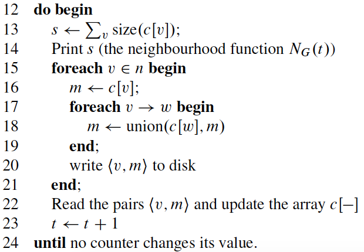
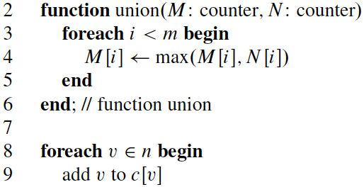
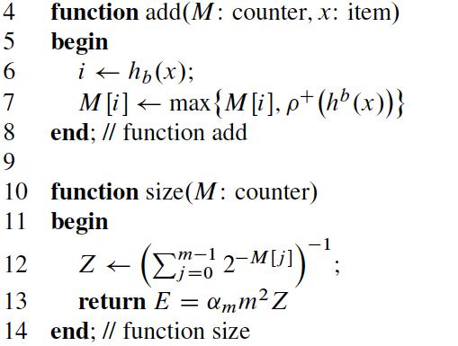

## <center>  GridGraph 实验报告

<center>夏鑫 2016210981 计研162</center>

### 内容列表

- [实验环境](#evr)
- [Pagerank Delta](#pr_ddf)  
- [HyperAnf](#anf)

### <a name="evr"></a> 实验环境

###### CPU 信息

| item | info |
| :---------: | :-------------------:  |
| processors 数量 | 8 |

###### 每个 processor 的信息

| item | info |
| :---------: | :-------------------:  |
| cpu MHz | 2601.421 |
| cpu cores | 4 |
| cache size | 6144 KB |

###### 内存信息

| item | info(kB) |
| :---------: | :-------------------:  |
| MemTotal | 16349472 |

###### Disk

| item | info |
| :---------: | :-------------------:  |
| MODEL | HGST HTS721010A9 |
| SIZE | 931.5G |
| 接口速率 | 1000GB | 


### <a name="pr_ddf"></a> Pagerank Delta

#### 算法实现

pagerank delta 和 pagerank 算法类似，只不过每一次记录 pagerank 的更改量，因此在本次实验中，使用 `delta` 和 `new_delta`   两个数组来保存上一轮的改变以及这一轮的改变，使用 `pagerank` 数组来保存每一个节点的 `pagerank`。具体定义如下：

```cpp
BigVector<float> pagerank(graph.path+"/pagerank_ddf", graph.vertices);
BigVector<float> delta(graph.path+"/delta_ddf", graph.vertices);
BigVector<float> new_delta(graph.path+"/new_delta_ddf", graph.vertices);
```

更新过程主要包含两部分，首先是遍历边来实现对 `new_delta` 的更新；随后通过遍历点对 `pagerank` 进行更新。具体代码如下

######遍历边

```cpp
graph.stream_edges<VertexId>(
	[&](Edge & e){
	write_add(&new_delta[e.target], delta[e.source]);
	return 0;
	}, nullptr, 0, 1,
	[&](std::pair<VertexId,VertexId> source_vid_range){
	new_delta.lock(source_vid_range.first, source_vid_range.second);
	},
	[&](std::pair<VertexId,VertexId> source_vid_range){
	new_delta.unlock(source_vid_range.first, source_vid_range.second);
	}
);
```

######遍历点

```cpp
graph.stream_vertices<VertexId>(
	[&](VertexId i){
	pagerank[i] = 0.15f + 0.85f * new_delta[i];
	delta[i] = 0;
	return 0;
	}, nullptr, 0,
	[&](std::pair<VertexId,VertexId> vid_range){
	pagerank.load(vid_range.first, vid_range.second);
	delta.load(vid_range.first, vid_range.second);
	},
	[&](std::pair<VertexId,VertexId> vid_range){
	pagerank.save();
	delta.save();
	}
);
```

#### 数据的初始化

初始时，认为每一个节点的 delta 是 1。因此每一个节点的初始 pagerank 是 `1 - DAMPING_FACTOR`。具体如下

```cpp
float init_rank = 1.f - DAMPING_FACTOR;
graph.stream_vertices<VertexId>(
	[&](VertexId i){
	pagerank[i] = init_rank;
	delta[i] = 1.f / degree[i];
	return 0;
	}, nullptr, 0 ,
	[&](std::pair<VertexId,VertexId> vid_range){
	pagerank.load(vid_range.first, vid_range.second);
	delta.load(vid_range.first, vid_range.second);
	},
	[&](std::pair<VertexId,VertexId> vid_range){
	pagerank.save();
	delta.save();
	}
);
```

#### 性能测试

######twitter-2010 (|V|=41652230) 迭代 10次

| 内存大小(GB) | degree calculation (s) | running time (s) |
| :---------: | :-------------------:  | :--------------: |
| 2 | 121.41 |1343.89 |
| 4 | 120.33 | 1348.80 |
| 8 | 119.85 | 1346.38 |

######uk-2007-05 (|V|=105896555) 迭代 10次

| 内存大小(GB) | degree calculation (s) | running time (s) |
| :---------: | :-------------------:  | :--------------: |
| 2 | 256.52 | 3370.01 |
| 4 | 245.64 | 3355.86 |
| 8 | 247.91 | 3352.76 |

### <a name="anf"></a> HyperAnf

#### 算法实现

HyperAnf 主要分为两部分，一个是 Anf 的迭代部分，一个是 Hyperloglog Counter 的计算部分。

##### Anf 迭代

具体算法如下



可以看到其实就是对边进行一次遍历，然后对点进行一次遍历，其中涉及到的操作都是 `Hyperloglog Counter` 的操作，具体如下：



#### Hyperloglog Counter

这种 `Counter` 主要的主要操作如下：



具体实现的诸多细节，使用的是 `x-stream` 中的实现。

#### 具体实现

定义两个数据结构用来存储 `Counter`:

```cpp
#define RSD 0.1 // 相对标准误差，表示 Counter 的准确程度
#define M 128 // Counter 的字节数，根据 RSD 计算得到

struct __attribute__((__packed__)) counter {
  unsigned char hll_ctr[M] HLL_ALIGN; //用来保存当前的 Counter 值
};

struct __attribute__((__packed__)) update_counter {
  bool change;
  unsigned char hll_ctr[M] HLL_ALIGN; //计算出来的 Counter 的更新
};
```

对应的数组如下：

```cpp
BigVector<counter> llh(graph.path+"/llh", graph.vertices);
BigVector<update_counter> update_llh(graph.path+"/update_llh", graph.vertices);
BigVector<double> count(graph.path+"/count_llh", graph.vertices); //用来保存最后的结果
```

对应到迭代的代码，首先是对边进行遍历：

```cpp
graph.stream_edges<VertexId>(
	[&](Edge & e){
		unsigned char *counter_src = llh[e.source].hll_ctr;
		unsigned char *counter_des = update_llh[e.target].hll_ctr;
		bool change = false;
		change = hll_union(counter_des, counter_src, &loglog_para);
		update_llh[e.target].change = change;
		return 0;
	}, nullptr, 0, 1,
	[&](std::pair<VertexId,VertexId> source_vid_range){
		update_llh.lock(source_vid_range.first, source_vid_range.second);
	},
	[&](std::pair<VertexId,VertexId> source_vid_range){
		update_llh.unlock(source_vid_range.first, source_vid_range.second);
	}
);
```

对边进行遍历的更新量保存在 `update_llh` 的 `Counter` 数组中，接着对点进行遍历：

```cpp
graph.stream_vertices<VertexId>(
	[&](VertexId i){
	if (update_llh[i].change){
		memcpy(llh[i].hll_ctr, update_llh[i].hll_ctr, M * sizeof(unsigned char));
	}
	count[i] = count_hll_counter(&loglog_para, llh[i].hll_ctr);
	return 0;
	}, nullptr, 0,
	[&](std::pair<VertexId,VertexId> vid_range){
		llh.load(vid_range.first, vid_range.second);
		count.load(vid_range.first, vid_range.second);
	},
	[&](std::pair<VertexId,VertexId> vid_range){
		llh.save();
		count.save();
	}
);
``` 

#### 初始化

一开始每一个节点的 `Counter` 数组中只有自己，因此需要添加节点到 `Counter` 中，具体如下：

```cpp
graph.stream_vertices<VertexId>(
	[&](VertexId i){
		unsigned long hash = jenkins(i, 0xdeadbeef);
		unsigned char *llh_ct = llh[i].hll_ctr;
		unsigned char *update_ct = update_llh[i].hll_ctr;
		add_hll_counter(&loglog_para, llh_ct, hash);
		add_hll_counter(&loglog_para, update_ct, hash);
		return 0;
	}, nullptr, 0
);
```

#### 性能测试

######twitter-2010 (|V|=41652230) 迭代 10次


| RSD | M | 内存(GB) | AVX2(union 操作是否使用) | 时间(s) |
| :-----: | :-----: | :-----: | :-----: | :----: |
| 0.4 | 8 | 8 | 否 | 1350.28 |
| 0.2 | 32 | 16 | 否 | 88139.83s |
| 0.2 | 32 | 16 | 是 | 2659.62 |
| 0.1 | 128 | 16 | 是 | 119799.11 |

